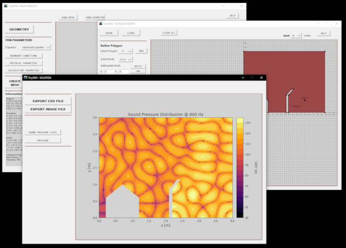
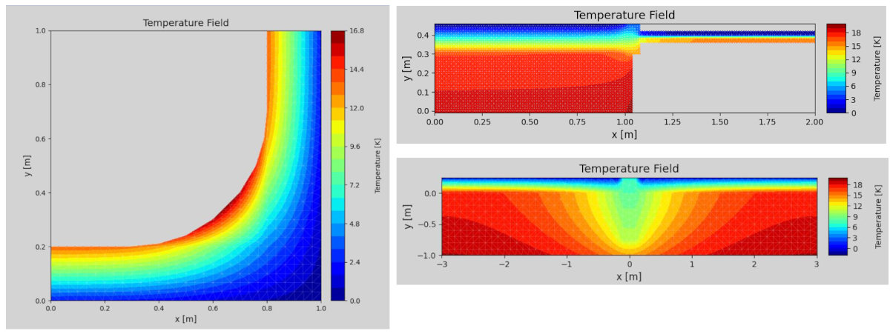
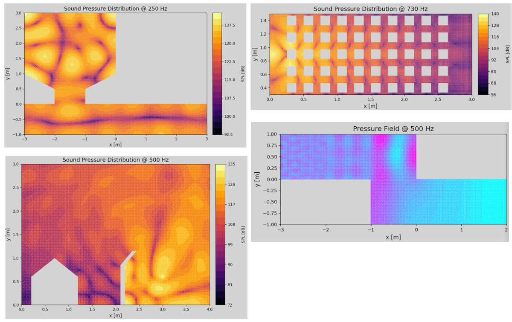

# TinyFEM
A tiny FEM software with graphical interface to define geometry and solve the heat and Helmholtz equations. 

## Table of Contents
- About
- Running TinyFEM
- Examples
- License

## About
### Capabilities
- All-In-One package for solving the stationary heat equation and Helmholtz equation.
- Graphical interface: Just run main.py.
- Including geometry creation: Define geometry by either graphical input or by entering vertice positions.
- Including definition of boundary conditions (Heat equation: Dirichlet, Neumann and Robin BC for most practical cases, Helmholtz equation: Dirichlet and Neumann BC for most practical cases).
- Including solver and graphical representation of solution.
- Please refer to [EXAMPLES](examples/Examples_TinyFEM.pdf) for capabilities demonstration.
### Limitations
- Solving the Helmholtz Equation: The worst option for shape functions for approximation of the solution of the Helmholtz or wave equation are linear elements. This software uses linear elements. Use at least 10 elements per wavelength.
- Meshing: Vast differences in the size of the areas leads to insufficient mesh density for the smaller areas and thus less accurate results.
- This software is SLOW for a number of reasons: Little performance optimization of the code, use of linear elements, use of standard solver for system of equations. All of those points are WIP.
### Accuracy and correctness of results
**No warranty of any kind is given for accuracy and correctness of the results. Any use is solely at the user's discretion. Commercial use is not recommended.**

This software was created solely for demonstration purposes and out of curiosity and makes no claim to the correctness of the results. Program errors, technical errors, and incorrect usage (such as defining incompatible geometry) do not necessarily lead to errors, and the results may appear plausible but may be partially or entirely incorrect.

However, the technical correctness has been verified by comparing it with other FEM frameworks, and reasonable agreement was found for the analyzed examples (see: [VERIFICATION](Supp/Verification_TinyFEM.pdf)). In case of doubt, the results must be independently verified.

## Running TinyFEM
### Workflow
- Please refer to the [QUICK DOCUMENTATION](Supp/Quick_Documentation_TinyFEM.pdf) for the workflow.
- Warning: If you want to define geometry much smaller than the geometry pane, scale the problem. This has no effect on the solution. Otherwise, definition of boundary conditions will be difficult.
- While saving the geometry is possible, saving boundary definition is not (WIP).
### Dependencies
The following non-standard libraries are needed to run TinyFEM:
- matplotlib: https://matplotlib.org/   -> pip install matplotlib
- numpy: https://numpy.org/ -> pip install numpy
- PIL: https://python-pillow.org/ -> pip install Pillow
- scipy: https://scipy.org/ -> pip install scipy
- shapely: https://shapely.readthedocs.io/ -> pip install shapely

## Examples
### Solving the heat equation with different materials and boundary conditions
- Supports fixed temperature, heat flux and convective heat flux

### Solving the Helmholtz equation with different materials and boundary conditions
- Supports sound hard boundary condition, impedance boundary condition and monopol sound sources

## License
The code in this repository is licensed under the [GNU GENERAL PUBLIC LICENSE Version 3, 29 June 2007](LICENSE.md).

_The authors: Elias Perras, Marius Mellmann_

